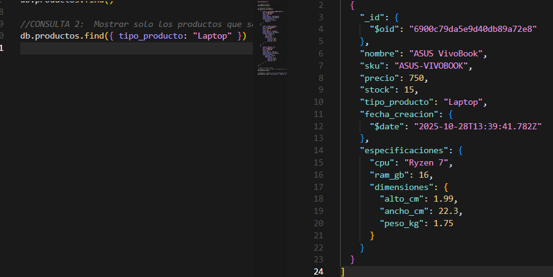
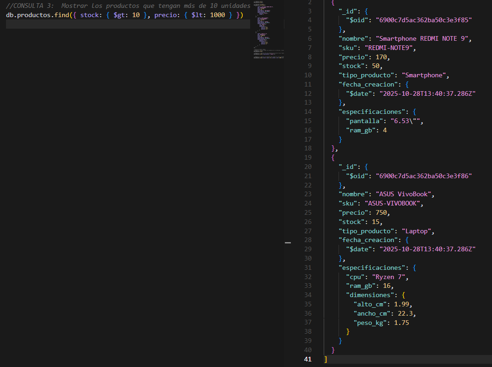
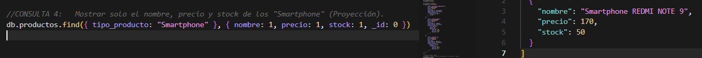
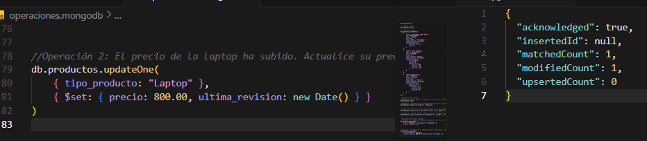

*****************************************************
                            FASE 1

*****************************************************

TABLA DE ANÁLISIS COMPARATIVO

| **Criterio**               | **Solución Relacional (SQL)** | **Solución NoSQL (MongoDB)**    |**Justificación para "TechStore"**   |

| **Flexibilidad de Esquema**| Rígido (requiere ALTER TABLE) | Flexible (documentos JSON/BSON) | TechStore maneja productos con atributos variables (Laptop, Smartphone, Monitor), por lo que la flexibilidad es clave. La aplicación de una solucion flexible se vulve fundamental|
| **Modelo de Datos**        | Tablas normalizadas           | Colección de documentos         | Un documento único por producto simplifica el modelo y evita múltiples JOINs, optimizando el proceso.                    |
| **Consulta de Datos**      | Requiere JOINs complejos para obtener detalles | Consulta simple a un único documento  | Evitar JOINs mejora el rendimiento y reduce la complejidad en consultas frecuentes minimizando el timepo de consulta.|

DISEÑO DEL MODELO RELACIONAL

FORMATO DE ESTRUCTURA JSON 

// Colección: productos 
{ 
"_id": "ObjectId(...)", 
"nombre": "String", 
"sku": "String (Indexado, Único)", 
"precio": "Number", 
"stock": "Number", 
"tipo_producto": "String (Enum: 'Laptop', 'Smartphone', 'Monitor')", 
"fecha_creacion": "Date", 
"especificaciones": { 
// Ejemplo Smartphone: 
// "pantalla": "6.1\"", 
// "ram_gb": 8, 
// Ejemplo Laptop: 
// "cpu": "Core i7", 
// "ram_gb": 16, 
// "dimensiones": { "alto_cm": 2.5, "ancho_cm": 35, "peso_kg": 1.8 } 
} 
} 

************************************************
                          FASE 2

************************************************

RESULTADOS DE LA EJECUCIÓN

Limpieza inicial

Inserción de datos

Consulta 1

Consulta 2

Consulta 3

Consulta 4

Actualización de Datos (Update)

Operación 1

Operación 2

Análisis Reflexivo

Pregunta 1: ¿Cuál fue la ventaja más significativa de usar un modelo de documento (MongoDB) para el caso "TechStore" en comparación con el modelo relacional que diseñó? 

Respuesta: La ventaja más significativa que se puede destacar es la flexibilidad del esquema, mongodb permite almacenar divversos productos con distintas caracteristicas o atributos en un solo documento,  evitando múltiples tablas y JOINs, lo que simplifica el diseño y mejora el rendimiento en consultas.
 

pregunta 2: ¿Cómo facilita el anidamiento de documentos (el campo especificaciones) la gestión de datos heterogéneos (diferentes atributos por producto)? 

Respuesta: El anidamiento permite incluir todas las especificaciones dentro del mismo documento, sin crear tablas adicionales. Esto hace que cada producto sea autosuficiente y reduce la complejidad de consultas, ya que toda la información se obtiene en una sola lectura.

Pregunta 3: ¿Qué problemas potenciales podría enfrentar esta base de datos a futuro si no se controla la flexibilidad del esquema (es decir, si se permite insertar cualquier dato)? 

Respuesta:Podría haber inconsistencias en los datos, atributos irrelevantes o duplicados, y dificultad para validar reglas de negocio. Esto afectaría la integridad y complicaría el análisis, además de generar problemas de rendimiento.

Pregunta 4: ¿Qué paso técnico recomendaría a continuación para "profesionalizar" esta base de datos? (Piense en rendimiento e integridad de datos que no cubrimos en este laboratorio).

Respuesta: Implementar un JSON Schema para validar documentos, crear índices en campos clave (como sku y tipo_producto) y aplicar políticas de control de datos para garantizar consistencia y optimizar consultas.