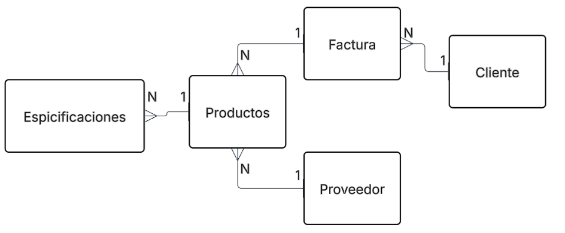
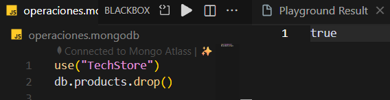
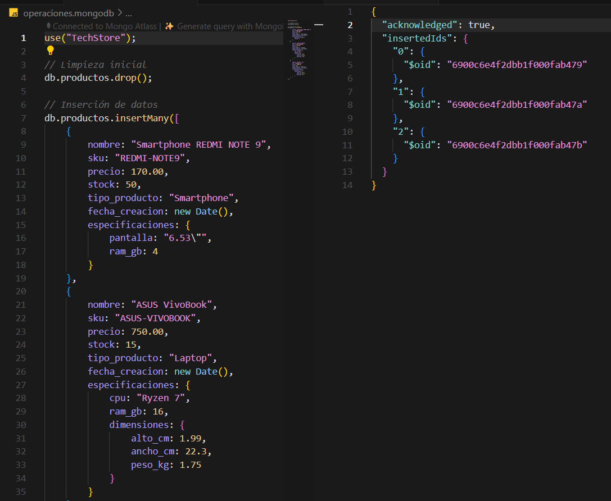
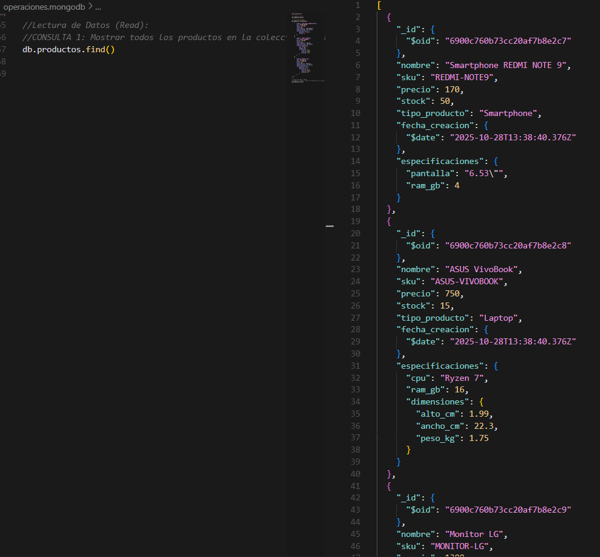

*****************************************************
                            FASE 1

*****************************************************

TABLA DE ANÁLISIS COMPARATIVO

| **Criterio**               | **Solución Relacional (SQL)** | **Solución NoSQL (MongoDB)**    |**Justificación para "TechStore"**   |

| **Flexibilidad de Esquema**| Rígido (requiere ALTER TABLE) | Flexible (documentos JSON/BSON) | TechStore maneja productos con atributos variables (Laptop, Smartphone, Monitor), por lo que la flexibilidad es clave. La aplicación de una solucion flexible se vulve fundamental|
| **Modelo de Datos**        | Tablas normalizadas           | Colección de documentos         | Un documento único por producto simplifica el modelo y evita múltiples JOINs, optimizando el proceso.                    |
| **Consulta de Datos**      | Requiere JOINs complejos para obtener detalles | Consulta simple a un único documento  | Evitar JOINs mejora el rendimiento y reduce la complejidad en consultas frecuentes minimizando el timepo de consulta.|

DISEÑO DEL MODELO RELACIONAL

FORMATO DE ESTRUCTURA JSON 

// Colección: productos 
{ 
"_id": "ObjectId(...)", 
"nombre": "String", 
"sku": "String (Indexado, Único)", 
"precio": "Number", 
"stock": "Number", 
"tipo_producto": "String (Enum: 'Laptop', 'Smartphone', 'Monitor')", 
"fecha_creacion": "Date", 
"especificaciones": { 
// Ejemplo Smartphone: 
// "pantalla": "6.1\"", 
// "ram_gb": 8, 
// Ejemplo Laptop: 
// "cpu": "Core i7", 
// "ram_gb": 16, 
// "dimensiones": { "alto_cm": 2.5, "ancho_cm": 35, "peso_kg": 1.8 } 
} 
} 

************************************************
                          FASE 2

************************************************

RESULTADOS DE LA EJECUCIÓN

